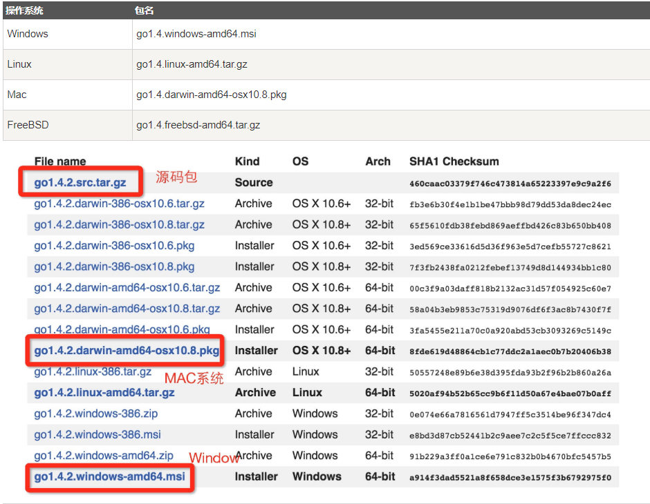

### 第二节、goLand的安装

上节我们讲述了go语言的发展史，这节我们将安装goland和配置环境变量;

#### goLand语言环境开发支持以下系统

* Linux
* Mac OS X（也称为 Darwin）
* Windows

### 一、下载地址
安装包下载地址为: [golang下载地址](https://golang.google.cn/dl/)

各个系统对应的包名：

### 二、安装

#### 双击运行安装包
下载完成之后一直点击NEXT就欧克了！
### 三、配置环境变量

##### 安装完成后需要在系统环境变量中设置

GOPATH为项目目录

GOROOT为安装目录

path中设置好安装目录到bin目录

### 四 、打开cmd,输入go env,出现如下配置生效

