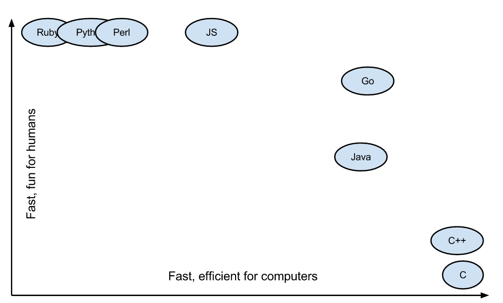

# 第01节: go简介

### 一、go语言发展史
Go（又称Golang）是Google开发的一种静态强类型、编译型、并发型，并具有垃圾回收功能的编程语言。

罗伯特·格瑞史莫（Robert Griesemer），罗勃·派克（Rob Pike）及肯·汤普逊（Ken Thompson）于2007年9月开始设计Go，稍后Ian Lance Taylor、Russ Cox加入项目。Go是基于Inferno操作系统所开发的。Go于2009年11月正式宣布推出，成为开放源代码项目，并在Linux及Mac OS X平台上进行了实现，后来追加了Windows系统下的实现。在2016年，Go被软件评价公司TIOBE 选为“TIOBE 2016 年最佳语言”。 目前，Go每半年发布一个二级版本（即从a.x升级到a.y）。 

### 二、go语言特色

* 简洁、快速、安全
* 并行、有趣、开源
* 内存管理、数组安全、编译迅速

### 三、为什么选择go?

* 天生的服务器编程语言。
* 天生的并发模型。
* Go 具有 Python/Ruby 的开发效率，同时又有 C 语言的运行性能（不过还是有一定差距的）。
* 静态语言。
* 简单（只有 25 个关键词）。
* 内存管理，简洁语法。
* 标准类库，规范统一（gofmt, golint…）。
* 文档全面，免费开源。
* 快速编译，易于部署（二进制文件包可直接运行）。

### 四、为什么互联网世界需要Go语言

#### Go语言简单易学

##### 语法简洁

* Go 语言简单易学，学习曲线平缓，不需要像 C/C++ 语言动辄需要两到三年的学习期。Go 语言被称为“互联网时代的C语言”。Go 语言的风格类似于C语言。其语法在C语言的基础上进行了大幅的简化，去掉了不需要的表达式括号，循环也只有 for 一种表示方法，就可以实现数值、键值等各种遍历。

##### 代码风格统一

* Go 语言提供了一套格式化工具——`go fmt`。一些 Go 语言的开发环境或者编辑器在保存时，都会使用格式化工具进行修改代码的格式化，这样就保证了不同开发者提交的代码都是统一的格式。(吐槽下：再也不用担心那些看不懂的黑魔法了…)

##### 开发效率高

Go语言实现了开发效率与执行效率的完美结合，让你像写Python代码（效率）一样编写C代码（性能）。