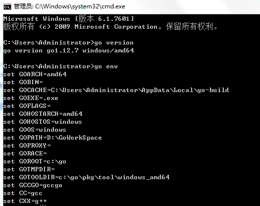

# 第02节、goLand的安装

上节我们讲述了go语言的发展史，这节我们将安装goland和配置环境变量;

#### goLand语言环境开发支持以下系统

* Linux
* Mac OS X（也称为 Darwin）
* Windows

### 一、下载地址
安装包下载地址为: [golang下载地址](https://golang.google.cn/dl/)

各个系统对应的包名：

### 二、安装
此安装实例以 `64位Win10`系统安装 `Go1.11.5`可执行文件版本为例。
将上一步选好的安装包下载到本地。

双击下载好的软件

### 三、配置

1. `GOPATH`是一个环境变量，用来表明你写的go项目的存放路径（工作目录）。
2. `GOPATH`路径最好只设置一个，所有的项目代码都放到`GOPATH`的`src`目录下。
3. 补充说明：Go1.11版本之后，开启`go mod`模式之后就不再强制需要配置GOPATH了。
4. windows平台按下面的步骤将D:\code\go添加到环境变量：

5. 使用cmd命令go version与go env测试安装包与环境变量是否安装成功。

6. 如上图所示则表示安装成功！