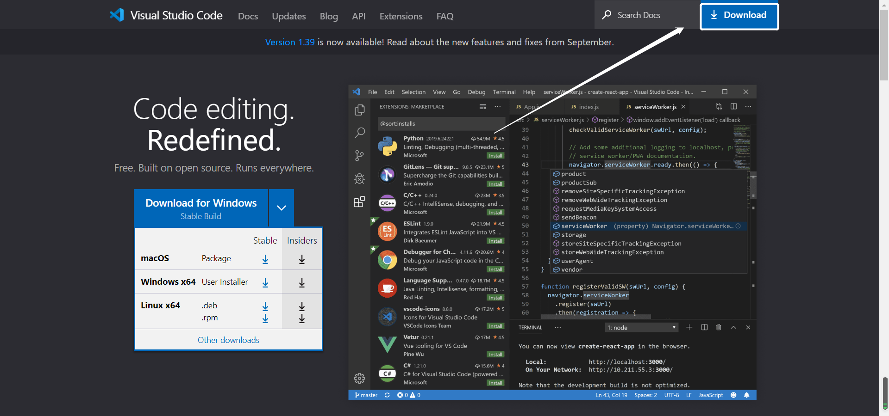
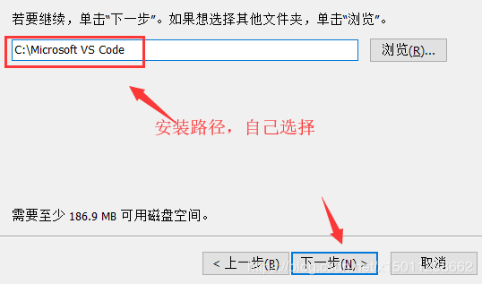
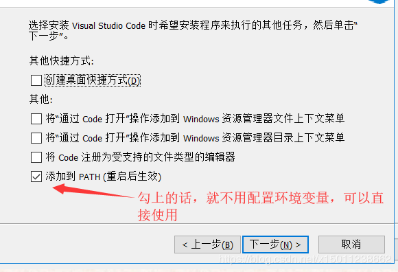
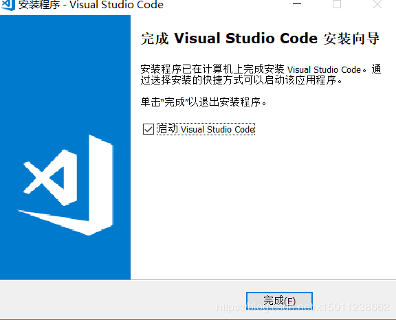
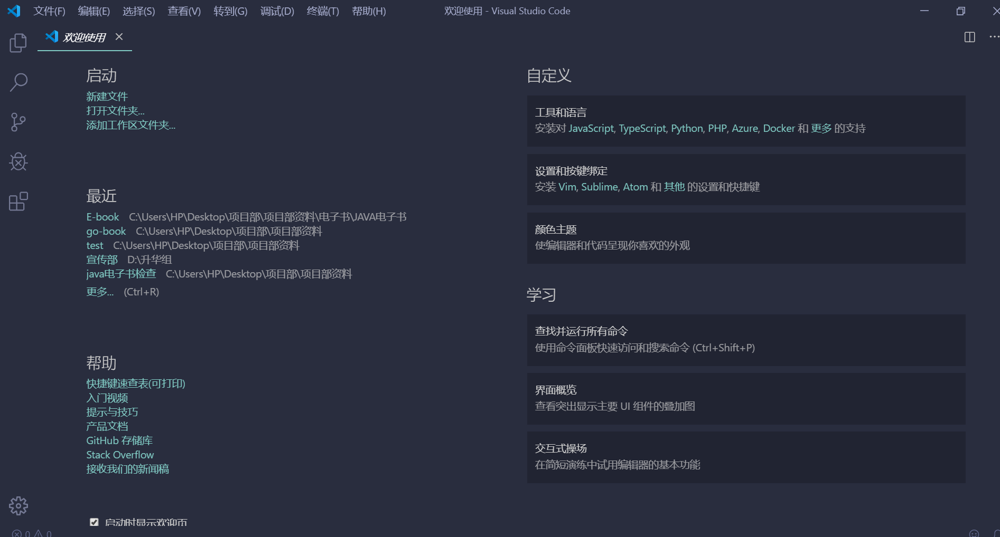
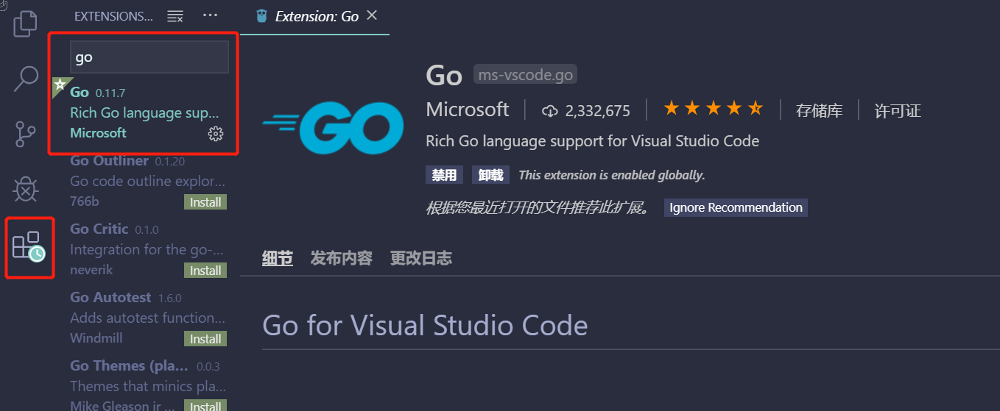

# 第03节：go开发工具安装

上节我们安装了golang及配置环境变量，那么这节我们将讲述go开发工具的下载及安装;

##### 这里我们推荐使用vscode 可以运行在Windows、Linux、Mac Os X上使用，默认提供Go语言语法高亮，安装Go语言插件后，就可以智能提示，编译等运行功能，

### 一、vscode下载
 
1.  [vscode安装包地址](https://code.visualstudio.com/)
2. 选择vscode版本（根据自己的操作系统选择相应的版本）

3. 把vscode安装文件准备好：我使用的是64位的操作系统

4. 傻瓜式安装，一直下一步，直接到完成

5. 环境变量（这步骤也是默认的，因为改编辑器是微软提供的，会自动配置path）

6. 安装成功

7. 安装结束后它会默认打开vscode 进入首界面如下图

8. 点击上图中的图标，进入插件搜索界面，然后器安装Go扩展插件，让它支持Go语言开发。

##### 安装中文插件
点击左侧菜单栏最后一项管理扩展，在搜索框中输入`chinese` ，选中结果列表第一项，点击`install`安装。

安装完毕后右下角会提示`重启VS Code`，重启之后你的VS Code就显示中文啦！

