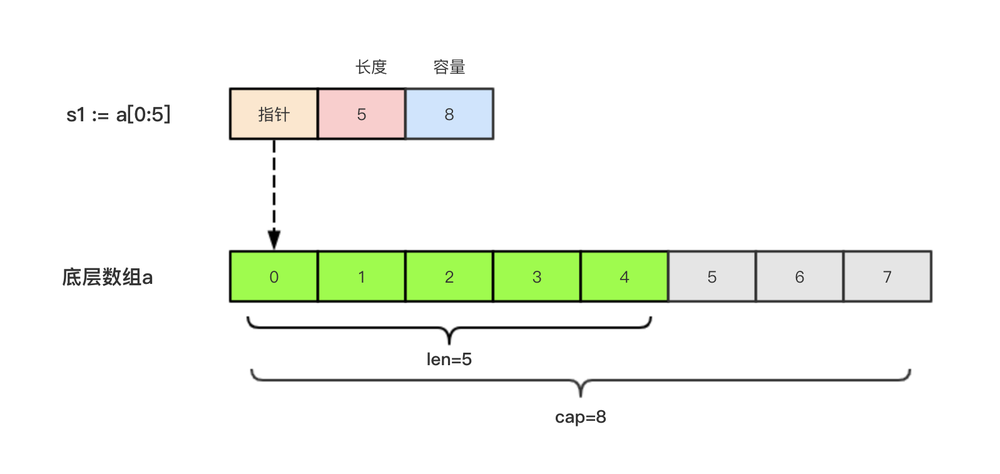
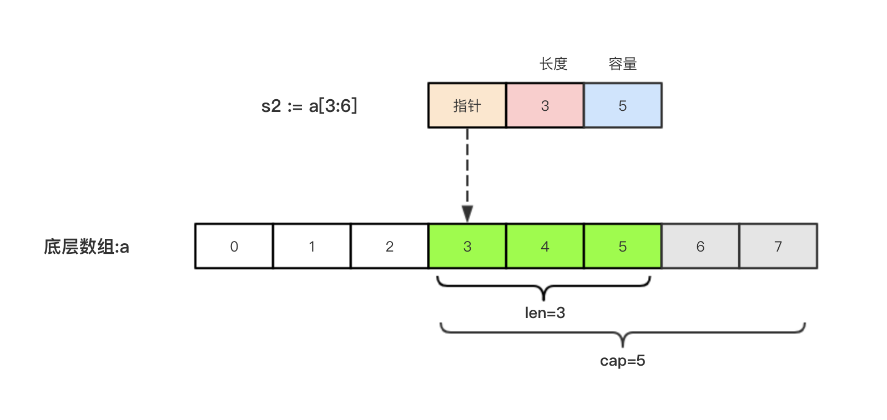

# 第01节:Go语言切片之基础

### 一、学习目标

本节主要介绍Go语言中切片（slice）及它的基本使用。

### 二、引子

因为数组长度是固定的并且数组长度属于类型的一部分，所以数组有很多局限性，例如:

```go
func arraySum(x [3] int ) int{
    sum := 0
    for _, v := range x{
        sum := sum + v
    }
    return num
}
```

这个求和函数只能接受`[3]int`类型，其它都不支持，在例如:

```go
a := [int]{1,2,3}
```

数组a中已经有三个元素了，不可以在继续添加元素;

### 三、切片

切片(Slice)是拥有相同类型元素可变长度序列，它是基于数组类型做的一层封装，它非常灵活，支持自动扩容;

切片是一个引用类型，它的内容包含`地址` `长度` 和 `容量` 切片一般用于快速的操作一块数据集合

##### 切片定义

声明切片类型的语法如下:

```go
var name []T
```

其中

* name表示:变量名

* T表示: 切片中的元素类型

举个例子:

```go
func main() {
	// 声明切片类型
	var a []string              //声明一个字符串切片
	var b = []int{}             //声明一个整型切片并初始化
	var c = []bool{false, true} //声明一个布尔切片并初始化
	// var d = []bool{false, true} //声明一个布尔切片并初始化
	fmt.Println(a)              //[]
	fmt.Println(b)              //[]
	fmt.Println(c)              //[false true]
	fmt.Println(a == nil)       //true
	fmt.Println(b == nil)       //false
	fmt.Println(c == nil)       //false
	// fmt.Println(c == d)   //切片是引用类型，不支持直接比较，只能和nil比较
}
```

##### 切片的长度和容量

切片拥有自己的长度和容量，我们可以通过内置的len()函数求长度，使用内置的cap()函数求切片容量;

##### 基于数组定义切片

由于切片底层就是一个数组，所以我们就可以基于数组定义切片。

```go
func main(){
    //基于数组定义切片
    a := [5]int{56,57,58,59}
    b := [1:4]
    fmt.println(b)
    fmt.printf("type of b:%T\n" , b) 
}
```

还支持一下格式:

```go
 c := a[1]   //[56 57 58 59]
 d := a[:4]  //[55 56 57 58]
 e := a[:]   //[55 56 57 58 59]
```

##### 切片再切片

除了基于数组数组得到的切片，我们还可以通过来得到切片;

```go
func main(){
//切片再切片
   a := [...]string{"北京", "上海", "广州", "深圳", "成都", "重庆"}
   fmt.Printf("a:%v type:%T len:%d  cap:%d\n", a, a, len(a), cap(a))
   b := a[1:3]
   fmt.Printf("b:%v type:%T len:%d  cap:%d\n", b, b, len(b), cap(b))
   c := b[1:5]
   fmt.Printf("c:%v type:%T len:%d  cap:%d\n", c, c, len(c), cap(c)
}
```

以上实例输出结果为:

```go
a:[北京 上海 广州 深圳 成都 重庆] type:[6]string len:6  cap:6
b:[上海 广州] type:[]string len:2  cap:5
c:[广州 深圳 成都 重庆] type:[]string len:4  cap:4
```

**注意:** 对切片进行切片再切片时，索引不能超过原数组长度，否则会出现索引越界错误;

##### 使用make()函数构造切片

上面我们讲述了基于数组来创建的切片，如果需要动态创建一个切片，我们就需要一个内置`make()` 函数，格式如下:

```go
make([]T,size,cap)
```

其中:

* T代表为:切片的元素类型
* size代表为:切片中元素数量
* cap代表为: 切片的容量

举个例子:

```go
func main(){
    a := make([]int,2,10)
    fmt.println(a)       //[ 0 0]
    fmt.println(len(a))  //2
    fmt.println(cap(a))  //10
}
```

上面代码中 `a` 的内部储存空间已经分配了10个，但是实际上才用了2个，容量不会影响当前元素个数，所以 `len()`返回2，`cap(a)` 则返回了该切片的容量;

##### 切片的本质

切片的本质就是对底层数组的封装，它包含了三个信息:底层数组指针、切片的长度len()和切片的荣两个cap().
举个例子，现在有一个数组 `a := [8]int{0,1,2,3,4,5,6,7}` 切片 `s1 := a[:5]`相应的数据图如下:



切片 `s2 := a[3:6]`相应数据图如下:



